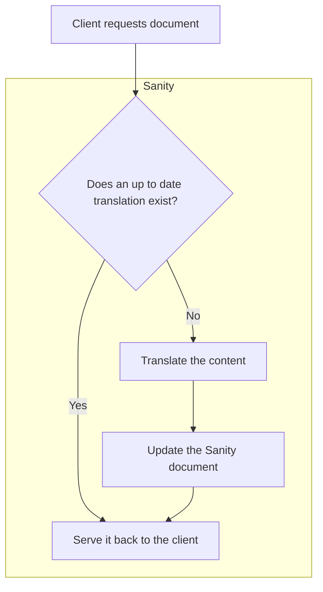

# Sanity translations experiment

This is a small experiment to see how we can use Sanity to manage translations for a React app.

Click here to see a rough diagram of how this should work

## MVP

### Content manager

1. As a content manager, I want to be able to create a document in Sanity with a title and a body written in US English.
1. As a content manager, I want to know that when a user device requests a document in te reo Māori, that the document will automatically be translated for them.
1. As a content manager, I want to be able to manually edit translated content.
1. _(stretch)_ As a content manager, I want to be able to manually trigger the AI-based translation of a document.
1. _(stretch)_ As a content manager, I want to be able to update the list of languages that a document can be translated into.

### User

1. As a user, I want to be able to view a document in my language. If my language is not yet supported, I want to see the document in English.

### Developer

1. As a developer, I want to be able to request a document from Sanity without having to worry about what language it is in.
