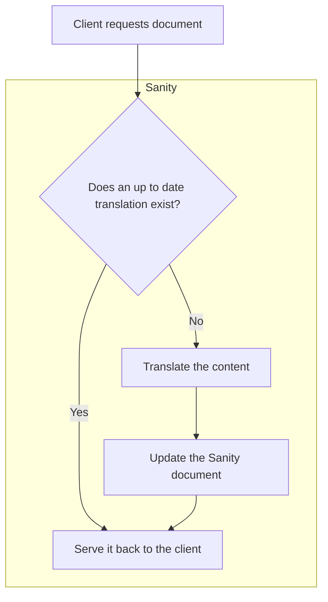

# Sanity translations experiment

This is a small experiment to see how we can use Sanity to manage translations for a React application.

The overarching goal is to simplify the handling of language, making less work for the content team, the developers, and ultimately provide a seamless experience for the user. See the [user stories](#mvp) for more details.

Here is a rough diagram of how this should work:

## MVP

### Content manager

1. ~~:memo: As a content manager, I want to be able to create a document in Sanity with a title and a body written in US English.~~ :white_check_mark:
1. ~~:globe_with_meridians: As a content manager, I want to know that when a user device requests a document in te reo Māori, that the document will automatically be translated for them.~~ :white_check_mark:
1. ~~:pencil2: As a content manager, I want to be able to manually edit translated content.~~ :white_check_mark:
1. ~~:earth*asia: *(stretch)\_ As a content manager, I want to be able to update the list of languages that a document can be translated into.~~ :white_check_mark:
1. ~~:robot: _(stretch)_ As a content manager, I want to be able to manually trigger the AI-based translation of a document.~~ :white_check_mark:

### User

1. ~~:book: As a user, I want to be able to view a document in my language. If my language is not yet supported, I want to see the document in English.~~ :white_check_mark:

### Developer

1. ~~:hammer_and_wrench: As a developer, I want to be able to request a document from Sanity without having to worry about what language it is in. :white_check_mark:~~
1. :hammer*and_wrench: *(stretch)\_ As a developer, I want to be able to plug this functionality into an existing Sanity project.
1. ~~:hammer*and_wrench: *(stretch)\_ As a developer, I want to be able to replace the existing translation layer with my own implementation.~~ :white_check_mark:

## Implementation details

The application follows a simple structure, comprising the following parts:

1. A React Web application: Used to display content.
1. A RESTful Node.js server: Responsible for requesting content from Sanity or routing through the translation layer when needed.
1. A translation layer: Utilises OpenAI to translate content.
1. Sanity studio: Manages the content.

## Getting started

### Prerequisites

- [Node.js](https://nodejs.org/en/download) (`v18.0.0`+)
- [pnpm](https://pnpm.io/installation) (`v8.7.6`+)

### Installation

1. Clone the repository
1. Install dependencies
   1. Web _(see [web/README.md](./web/README.md))_
   1. Studio _(see [studio/README.md](./studio/README.md))_
1. Run the layers you need:
   1. Web (`cd web && pnpm dev`): http://localhost:3000
   1. Studio (`cd studio && pnpm dev`): http://localhost:3333
1. Have fun!
